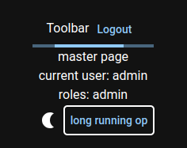
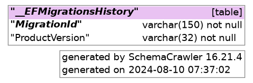

# example-webapp-with-auth

- [features](#features)
- [quickstart](#quickstart)
- [prerequisites](#prerequisites)
  - [local db](#local-db)
- [test it](#test-it)
- [db dia gen](#db-dia-gen)
- [production deployment](#production-deployment)
  - [db machine prerequisite](#db-machine-prerequisite)
  - [ssh config on development machine](#ssh-config-on-development-machine)
  - [target machine](#target-machine)
  - [copy production files](#copy-production-files)
  - [setup service](#setup-service)
- [how this project was built](#how-this-project-was-built)

<hr/>

## features

- started from clone from [example web app](https://github.com/devel0/example-webapp?tab=readme-ov-file)
  - asp net core backend
  - react frontend + vite tooling
  - https self signed cert development
  - backend and frontend debugging in a solution
  - publish release with frontend webpacked available through server static files available directly from within backend
  - step by step how this project was built by git commit
- configuration user-secrets, environment variables, and appsettings.json, appsettings.[Environment].json with autoreload on change
- jwt auth secure, httponly, strict samesite
- react redux
- login public page and protected routes
- theme light/dark, snacks

## quickstart

## prerequisites

### local db

- local db setup

```sh
apt install pwgen
mkdir -p ~/security/devel/ExampleWebApp
chmod 700 ~/security
pwgen -s 12 -n 1 > ~/security/devel/postgres
echo "$(pwgen -s 12 -n 1)#" > ~/security/devel/ExampleWebApp/admin
pwgen -s 12 -n 1 > ~/security/devel/ExampleWebApp/postgres-user
echo "localhost:*:*:postgres:$(cat ~/security/devel/postgres)" >> ~/.pgpass
chmod 600 ~/.pgpass
```  

- config user secrets replacing REPL_ vars

```sh
SEED_ADMIN_EMAIL=REPL_ADMIN_EMAIL
SEED_ADMIN_PASS=REPL_ADMIN_PASS
DB_PROVIDER="Postgres"
DB_CONN_STRING="Host=localhost; Database=REPL_DBNAME; Username=REPL_DBUSER; Password=REPL_DBPASS"
JWTKEY="$(openssl rand -hex 32)"

dotnet user-secrets init
dotnet user-secrets set "SeedUsers:Admin:Email" "$SEED_ADMIN_EMAIL"
dotnet user-secrets set "SeedUsers:Admin:Password" "$SEED_ADMIN_PASS"
dotnet user-secrets set "DbProvider" "$DB_PROVIDER"
dotnet user-secrets set "ConnectionStrings:Sample" "$DB_CONN_STRING"
dotnet user-secrets set "JwtSettings:Key" "$JWTKEY"
```

- install postgres as docker and psql client in the host

```sh
docker volume create pgdata
docker run -e POSTGRES_PASSWORD=`cat ~/security/devel/postgres` --restart=unless-stopped --name postgres -v pgdata:/var/lib/postgresql/data -d -p 5432:5432/tcp postgres:latest
apt install postgresql-client-16
```  

- this will allow you to connect to localhost postgres db as postgres user ( test with `psql -h localhost -U postgres` if connects )

- create postgres `example_webapp_user` user with capability to createdb

```sh
echo "CREATE USER example_webapp_user WITH PASSWORD '$(cat ~/security/devel/ExampleWebApp/postgres-user)' CREATEDB" | psql -h localhost -U postgres
```

## test it

```sh
git clone https://github.com/devel0/example-webapp-with-auth.git
cd example-webapp-with-auth
code .
```

- choose `.NET Core Launch (web)` from run and debug then hit F5 ( this will start asp net web server on `https://webapp-test.searchathing.com/swagger/index.html` )

- start vite

```sh
cd clientapp
npm run dev
```

- choose `Launch Chrome` from run and debug then click the play icon ( this will start browser )

- try to login/current user/logout/current user button from frontend

- login page


- master page



## db dia gen

database diagram can be generated through `db-dia-gen.sh` script that uses schemacrawler ( [more][1] )



## production deployment

- change `linux-x64` with target platform: `linux-x64`, `win-x64`, `osx-x64`

```sh
dotnet publish -c Release --runtime linux-x64 --sc
```

- note: option `--sc` makes self contained with all required runtimes ( ie. no need to install dotnet runtime on the target platform )

- published files will be in `WebApiServer/bin/Release/net8.0/linux-x64/publish/`

### db machine prerequisite

```sh
apt install postgres
su - postgres
psql
postgres=# CREATE USER webapp_test_user WITH ENCRYPTED PASSWORD 'DBPASS' CREATEDB;
CREATE ROLE
```

- tune postgres host allowed `/etc/postgresql/16/main/my.conf`

```sh
listen_addresses = '*'
```

- tune postgres db permissions `/etc/postgresql/16/main/pg_hba.conf` ( replace `TARGETMACHINEIP` with ip of the target machine where the app will run )

```sh
# TYPE  DATABASE        USER                  ADDRESS                 METHOD
host    webapp_test     webapp_test_user      TARGETMACHINEIP/32      scram-sha-256
host    postgres        webapp_test_user      TARGETMACHINEIP/32      scram-sha-256
```

### ssh config on development machine

```sh
Host main-test
  HostName TARGETMACHINEIP
  User root
  IdentityFile ~/.ssh/main-test.id_rsa
```

- append `~/.ssh/main-test.id_rsa.pub` content to the target machine `/root/.ssh/authorized_keys`

### target machine

- from target machine:

```sh
apt install openssh-server rsync nginx
useradd -m user
mkdir /root/secrets
```

### copy production files

- from development machine:

```sh
rsync -arvx --delete WebApiServer/bin/Release/net8.0/linux-x64/publish/ main-test:/srv/app
```

### setup service

- from development machine:

```sh
scp deploy/nginx.d/prod/webapp-test.conf main-test:/etc/nginx/conf.d
scp deploy/service/webapp-test.service main-test:/etc/systemd/system
scp deploy/webapp-test.env main-test:/root/secrets
```

- from target machine:

```sh
# tune secrets
nano /root/secrets/webapp-test.env
systemctl enable webapp-test
service webapp-test start
```

## how this project was built

- started from clone from [example web app](https://github.com/devel0/example-webapp/blob/e9328b16212f1d128518088bb8a2c4b620c2035e/readme.md#how-this-project-was-built)

- more frontend pkgs

```sh
cd example-webapp-with-auth
cd clientapp
npm install @mui/material @emotion/react @emotion/styled @mui/icons-material
npm i @reduxjs/toolkit react-redux react-router-dom axios linq-to-typescript usehooks-ts @fontsource/roboto
```

- create app dbcontext

```sh
cd example-webapp-with-auth
dotnet new classlib -n AppDbContext
dotnet sln add AppDbContext
cd AppDbContext
dotnet add package Microsoft.AspNetCore.Identity.EntityFrameworkCore --version 8.0.5
dotnet add package Microsoft.EntityFrameworkCore.Design --version 8.0.5
```

- create app dbcontext migration

```sh
cd example-webapp-with-auth
dotnet new classlib -n AppDbMigrationsPsql
dotnet sln add AppDbMigrationsPsql
cd AppDbMigrationsPsql
dotnet add package Microsoft.EntityFrameworkCore.Relational --version 8.0.5
dotnet add package Npgsql.EntityFrameworkCore.PostgreSQL --version 8.0.4
dotnet add reference ../AppDbContext
```

- add db pkgs to webapi sever

```sh
cd example-webapp-with-auth
cd WebApiServer
dotnet add package Microsoft.EntityFrameworkCore.Design --version 8.0.5
dotnet add package Microsoft.AspNetCore.Authentication.JwtBearer --version 8.0.5
dotnet add reference ../AppDbContext
dotnet add reference ../AppDbMigrationsPsql

openssl rand -hex 32 > ~/security/devel/ExampleWebApp/jwt.key

dotnet new tool-manifest
dotnet tool install dotnet-ef

dotnet user-secrets init
dotnet user-secrets set "JwtSettings:Key" "$(cat ~/security/devel/ExampleWebApp/jwt.key)"

SEED_ADMIN_EMAIL=admin@admin.com
SEED_ADMIN_PASS=$(cat ~/security/devel/ExampleWebApp/admin)

DB_PROVIDER="Postgres"
DB_CONN_STRING="Host=localhost; Database=ExampleWebApp; Username=example_webapp_user; Password=$(cat ~/security/devel/ExampleWebApp/postgres-user)"

dotnet user-secrets set "SeedUsers:Admin:Email" "$SEED_ADMIN_EMAIL"
dotnet user-secrets set "SeedUsers:Admin:Password" "$SEED_ADMIN_PASS"
dotnet user-secrets set "DbProvider" "$DB_PROVIDER"
dotnet user-secrets set "ConnectionStrings:Sample" "$DB_CONN_STRING"

dotnet add package Microsoft.IdentityModel.Tokens --version 7.5.2
dotnet add package System.IdentityModel.Tokens.Jwt --version 7.5.2
```

- Add files...

- add initial migration

```sh
cd example-webapp-with-auth
cd WebApiServer
dotnet ef migrations add init --project ../AppDbMigrationsPsql -- --provider Postgres
```

[1]: https://github.com/devel0/knowledge/blob/168e6cec6fdc0298b21d758c198d6f9210032ba8/doc/psql-schema-crawler.md