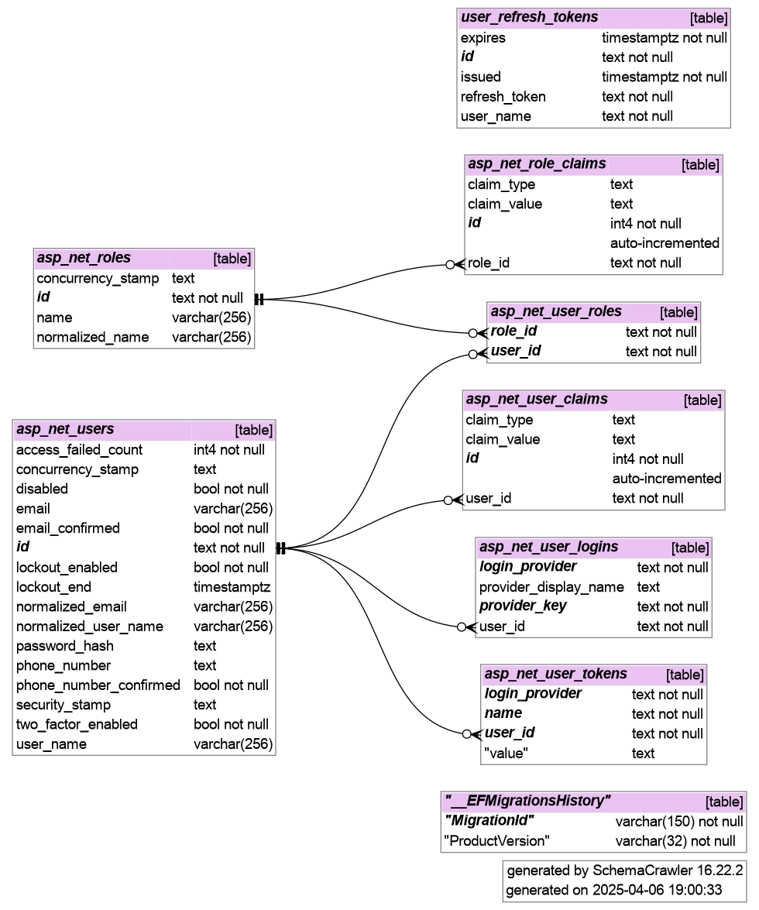

# example-webapp-with-auth

- [features](#features)
- [project folders](#project-folders)
- [quickstart (dev)](#quickstart-dev)
  - [clone sources and install template](#clone-sources-and-install-template)
  - [create project source tree](#create-project-source-tree)
  - [configure project](#configure-project)
  - [configuration parameters for mail server](#configuration-parameters-for-mail-server)
  - [start debug](#start-debug)
- [prerequisites](#prerequisites)
  - [development database setup](#development-database-setup)
  - [create selfsigned cert](#create-selfsigned-cert)
  - [setup development nginx](#setup-development-nginx)
  - [adjust local dns](#adjust-local-dns)
  - [install root ca for local development](#install-root-ca-for-local-development)
- [dev notes](#dev-notes)
  - [JWT auth access and refresh token](#jwt-auth-access-and-refresh-token)
  - [backend](#backend)
    - [run tests](#run-tests)
    - [configuration parameters](#configuration-parameters)
    - [add more migrations](#add-more-migrations)
    - [db dia gen](#db-dia-gen)
  - [frontend](#frontend)
    - [configuration parameters](#configuration-parameters-1)
    - [openapi usage](#openapi-usage)
    - [invoke api](#invoke-api)
  - [white papers](#white-papers)
    - [reset password](#reset-password)
    - [user manager](#user-manager)
    - [username and password criteria](#username-and-password-criteria)
    - [predefined roles and permissions](#predefined-roles-and-permissions)
- [production deployment (linux platform)](#production-deployment-linux-platform)
  - [db machine prerequisite](#db-machine-prerequisite)
  - [ssh config on development machine](#ssh-config-on-development-machine)
  - [target machine](#target-machine)
  - [publish to target machine](#publish-to-target-machine)
    - [manual tuning](#manual-tuning)
  - [published files and folders](#published-files-and-folders)
- [how this project was built](#how-this-project-was-built)

<hr/>

## features

- Security
  - Development with https self signed wildcard certs
  - JWT auth flags `secure`, `httponly`, `samesite` strict
  - Roles `admin`, `advanced`, `normal` with static [UserPermission][2] matrix

- Backend
  - C# asp net core
  - Configuration
    - development user-secrets
    - appsettings.json, appsettings.[Environment].json ( autoreload on change )
    - environment variables

- Frontend
  - Typescript react frontend + vite tooling
  - React redux `GlobalState` for current user
  - Layout with responsive appbar, public and protected pages with react router dom
  - Openapi typescript/axios generate from backend swagger endpoint
  - Login / Logout / Reset lost password through email link
  - User manager with auth controller [edit user][3] to create, edit username, password, email, roles, disable
  - Light/Dark themes, Snacks
  - PWA capabilities ( installable w/chrome )

- Debugging
  - backend and frontend debugging in a solution from the same IDE

- Production
  - publish release with frontend webpacked available through server static files available directly from within backend
  - publish deployment script with systemd service and environment secrets

## project folders

```
├── deploy
│   ├── nginx
│   │   ├── dev
│   │   └── prod
│   ├── scripts
│   └── service
├── doc
│   └── website-media
├── misc
└── src
    ├── backend
    │   ├── abstractions
    │   ├── db-context
    │   ├── db-migrations-psql
    │   ├── test
    │   └── webapi
    └── frontend
        ├── api
        ├── dist
        ├── node_modules
        ├── public
        └── src
```

| folder                         | description                                                          |
| ------------------------------ | -------------------------------------------------------------------- |
| deploy                         | deploy files                                                         |
| deploy/nginx                   | deploy nginx conf files for dev and prod                             |
| deploy/scripts                 | deploy scripts ( prepare.sh )                                        |
| deploy/service                 | `/etc/systemd/system` service files                                  |
| doc                            | project documents, db. diagram                                       |
| misc                           | misc scripts ( restore scripts exec permissions, db dia gen script ) |
| src                            | sources                                                              |
| src/backend                    | c# backend                                                           |
| src/backend/abstractions       | c# backend abstraction services                                      |
| src/backend/db-context         | c# database context                                                  |
| src/backend/db-migrations-psql | c# ef core psql migrations                                           |
| src/backend/test               | c# backend integration test                                          |
| src/backend/webapi             | c# webapi backend                                                    |
| src/frontend                   | react typescript frontend                                            |
| src/frontend/api               | typescript openapi autogenerated api                                 |
| src/frontend/node_modules      | results of `npm i` installed modules                                 |
| src/frontend/public            | frontend public folder                                               |
| src/frontend/src               | react typescript frontend app                                        |

## quickstart (dev)

- see [**prerequisites**](#prerequisites) to setup self signed dev cert and nginx proxy

### clone sources and install template

- clone repo

```sh
git clone https://github.com/devel0/example-webapp-with-auth.git
cd example-webapp-with-auth
dotnet new install .
cd ..
```

### create project source tree

```sh
dotnet new webapp-with-auth -n project-folder --namespace My.Some
cd project-folder
source misc/restore-permissions.sh
dotnet build
```

### configure project

- set shell variables replacing *REPL_* vars

```sh
SEED_ADMIN_EMAIL=REPL_ADMIN_EMAIL
SEED_ADMIN_PASS="REPL_ADMIN_PASS"
DB_PROVIDER="Postgres"
DB_CONN_STRING="Host=localhost; Database=ExampleWebApp; Username=example_webapp_user; Password=$(cat ~/security/devel/ExampleWebApp/postgres-user)"
JWTKEY="$(openssl rand -hex 32)"
```

optionally set unit test conn string

```sh
UNIT_TEST_DB_CONN_STRING="Host=localhost; Database=ExampleWebAppTest; Username=example_webapp_user; Password=$(cat ~/security/devel/ExampleWebApp/postgres-user)"
```

- set development user secrets

```sh
cd src/backend/webapi
dotnet user-secrets init

dotnet user-secrets set "AppConfig:Auth:Jwt:Key" "$JWTKEY"

dotnet user-secrets set "AppConfig:Database:Seed:Users:0:Username" "admin"
dotnet user-secrets set "AppConfig:Database:Seed:Users:0:Email" "$SEED_ADMIN_EMAIL"
dotnet user-secrets set "AppConfig:Database:Seed:Users:0:Password" "$SEED_ADMIN_PASS"
dotnet user-secrets set "AppConfig:Database:Seed:Users:0:Roles:0" "admin"

dotnet user-secrets set "AppConfig:Database:ConnectionName" "Development"
dotnet user-secrets set "AppConfig:Database:Connections:0:Name" "Development"
dotnet user-secrets set "AppConfig:Database:Connections:0:ConnectionString" "$DB_CONN_STRING"
dotnet user-secrets set "AppConfig:Database:Connections:0:Provider" "$DB_PROVIDER"

# optionally configure also unit test db
dotnet user-secrets set "AppConfig:Database:Connections:1:Name" "UnitTest"
dotnet user-secrets set "AppConfig:Database:Connections:1:ConnectionString" "$UNIT_TEST_DB_CONN_STRING"
dotnet user-secrets set "AppConfig:Database:Connections:1:Provider" "$DB_PROVIDER"

cd ..
```

- example result of `dotnet user-secrets list`

```sh
AppConfig:Database:Seed:Users:0:Username = admin
AppConfig:Database:Seed:Users:0:Roles:0 = admin
AppConfig:Database:Seed:Users:0:Password = ADMINPASS
AppConfig:Database:Seed:Users:0:Email = ADMIN@EMAIL.COM
AppConfig:Database:Connections:1:Provider = Postgres
AppConfig:Database:Connections:1:Name = UnitTest
AppConfig:Database:Connections:1:ConnectionString = Host=localhost; Database=ExampleWebAppTest; Username=example_webapp_user; Password=DBPASS
AppConfig:Database:Connections:0:Provider = Postgres
AppConfig:Database:Connections:0:Name = Development
AppConfig:Database:Connections:0:ConnectionString = Host=localhost; Database=ExampleWebApp; Username=example_webapp_user; Password=DBPASS
AppConfig:Database:ConnectionName = Development
AppConfig:Auth:Jwt:Key = xxxxxxxxxxxxxxxxxxxxxxxxxxxxxxxxxxxxxxxxxxxxxxxxxxxxxxxxxxxxxxxx
```

### configuration parameters for mail server

- to be able to use the reset password feature configure also the smtp server

```sh
cd src/backend/webapi
dotnet user-secrets set "EmailServer:SmtpServerName" REPL_MAILSERVER_HOSTNAME
dotnet user-secrets set "EmailServer:SmtpServerPort" REPL_MAILSERVER_PORT
dotnet user-secrets set "EmailServer:Security" REPL_MAILSERVER_SECURITY
dotnet user-secrets set "EmailServer:Username" REPL_MAILSERVER_USER_EMAIL
dotnet user-secrets set "EmailServer:Password" REPL_MAILSERVER_USER_PASSWORD
cd ..
```

accepted values for `EmailServer:Security` are `Tls`, `Ssl`, `Auto`, `None`.

### start debug

```sh
code .
```

- choose `.NET Core Launch (web)` from run and debug then hit F5 ( this will start asp net web server on `https://webapp-test.searchathing.local/swagger/index.html` )

- restore client node modules

```sh
cd ../frontend
npm i
cd ../..
```

- start frontend

```sh
./run-frontend.sh
```

- choose `Launch Chrome` from run and debug then click the play icon ( this will start browser )

- try to login/current user/logout/current user button from frontend

- login page


- master page


- user manager


## prerequisites

### development database setup

- create db secrets

```sh
apt install pwgen
mkdir -p ~/security/devel/ExampleWebApp
chmod 700 ~/security
pwgen -s 12 -n 1 > ~/security/devel/postgres
echo "$(pwgen -s 12 -n 1)#" > ~/security/devel/ExampleWebApp/admin
pwgen -s 12 -n 1 > ~/security/devel/ExampleWebApp/postgres-user
echo "localhost:*:*:postgres:$(cat ~/security/devel/postgres)" >> ~/.pgpass
chmod 600 ~/.pgpass
```  

- install postgres as docker and psql client in the host

```sh
docker volume create pgdata
docker run -e POSTGRES_PASSWORD=`cat ~/security/devel/postgres` --restart=unless-stopped --name postgres -v pgdata:/var/lib/postgresql/data -d -p 5432:5432/tcp postgres:latest
apt install postgresql-client-16
```  

- this will allow you to connect to localhost postgres db as postgres user ( test with `psql -h localhost -U postgres` if connects )

- create postgres `example_webapp_user` user with capability to createdb

- local db setup

```sh
echo "CREATE USER example_webapp_user WITH PASSWORD '$(cat ~/security/devel/ExampleWebApp/postgres-user)' CREATEDB" | psql -h localhost -U postgres
```

### create selfsigned cert

- clone [linux-scripts-utils](https://github.com/devel0/linux-scripts-utils)

```sh
mkdir -p ~/opensource
cd ~/opensource
git clone git@github.com:devel0/linux-scripts-utils.git
export PATH=$PATH:~/opensource/linux-scripts-utils
mkdir -p ~/sscerts
chmod 700 ~/sscerts
```

- create cert parameters file `~/sscerts/searchathing.local.params` ( replace `searchathing.local` with your own )

```
COUNTRY="IT"
STATE="Italy"
CITY="Trento"
ORGNAME="SearchAThing"
ORGUNIT="Development"
DOMAIN=localhost
DURATION_DAYS=36500 # 100 years
```

- create root-ca certificates

```sh
CERTPARAMS=~/sscerts/searchathing.local.params create-root-ca.sh
```

- generated root-ca files

| file                               | description                                                                             |
| ---------------------------------- | --------------------------------------------------------------------------------------- |
| `~/sscerts/searchathing.local.crt` | root-ca certificate that you can register into the browser to trust linked certificates |
| `~/sscerts/searchathing.local.key` | key of the root-ca certificte ( this is NOT NEEDED anywhere, do not share )             |

- create test certificates ( note: this generate a wildcard certificate `*.yourdomain`, so can be reused for other development projects )

```sh
CERTPARAMS=~/sscerts/searchathing.local.params create-cert.sh --add-empty --add-wildcard
```

| file                                                  | description                                  |
| ----------------------------------------------------- | -------------------------------------------- |
| `~/sscerts/searchathing.local/searchathing.local.crt` | is the certificate crt for nginx https proxy |
| `~/sscerts/searchathing.local/searchathing.local.key` | is the certificate key for nginx https proxy |

### setup development nginx

- install nginx

```sh
apt install nginx
```

- create `/etc/nginx/conf.d/dev-webapp-test.conf` by symlink [webapp-test.conf](./deploy/nginx/dev/webapp-test.conf)

```sh
cd /etc/nginx/conf.d
ln -s PATH_TO/example-webapp-with-auth/deploy/nginx/dev/webapp-test.conf dev-webapp-test.conf
```

### adjust local dns

- edit `/etc/hosts`

```sh
127.0.0.1  localhost

#-----------------------------------
# DEVELOPMENT
#-----------------------------------
127.0.0.1 dev-webapp-test.searchathing.local
```

### install root ca for local development

Installing root-ca certificate imply that certificates generated within that will be consequently trusted.

- **chrome**: settings/Privacy and security/Security/Manage certificates/Authorities/Import
  - select `~/sscerts/searchathing.local_CA.crt`
  - tick `Trust this certificate for identifying websites`

- **firefox**: settings/Privacy & Security/Certificates/View Certificates/Authorities/Import
  - select `~/sscerts/searchathing.local_CA.crt`
  - tick `Trust this CA to identify websites`
  
- **shell**
  - copy `~/sscerts/searchathing.local_CA.crt` to `/usr/local/share/ca-certificates`
  - issue `sudo update-ca-certificates`

## dev notes

### JWT auth access and refresh token

- authentication and authorization are managed entirely by the backend, in fact the frontend doesn't store any access token or restore token in local storage ; from the frontend side point of view the authentication is transparently managed through the browser `X-Access-Token` and `X-Refresh-Token` that the [server][23] sets after successful login through `Set-Cookie` header ( the frontend only call the login and logout webapi without storing anything on javascript side ):
  - XSS ( Cross-site scripting ) attack are prevented because the absence of access token from the local storage makes javascript unable to read these token
  - CSRF ( Cross-site request forgery ) attack are prevented because the cookie is stored within follow attributes
    - `secure` : prevent the cookie to be stored against a phising site because https will identify the server autenticity
    - `httponly` : prevent the javascript to read the cookie ( only the browser can handle by sending through the request header )
    - `samesite strict` : prevent to send the access token to other servers
- web api controller methods are executable only from user with valid access token because of the [`[Authorize]`][24] attribute ; further refinement can require user to have one or more roles through the attribute specialization with [`Roles`][25]. To allow anonymous api use [`[AllowAnonymous]`][26] attribute.
- use of the access token allow the server to authenticate the user by reading user, role and other info contained in the token itself; note that these info are not encrypted and can be viewed, but the token contains a signature that can't be generated from other than the server that contains the JWT key to create the signature itself. In other words the server validate the access token and signature match considering as valid the provided identity informations ( because it was the server itself that signed the data no other could generate corresponding signature ). This requires less hardware resources than using a db to validate the user.
- for paranoid setting the expiration of an access token should short and this maintain ability to execute high rate operations retaining the ability to block a user within a short response time. In fact a valid access token can't revoked by default rule but having a short time of validity allow the server to ban any other authorized api for that user simply disabling it. In fact after user is disabled the process of renew of another access token, even with a valid refresh token ( that has longer expire time ) gets [disabled immediately][27].
- in order to allow frontend application run longer than refresh token expiration, expecially if used a short refresh token ( ie. 5min ), the [frontend will schedule][30] a renew of refresh token, using the current valid auth, 30sec before the refresh token expires; this way the session continue without the need to login again. Following an excerpt with testing parameters ( AccessTokenDurationSeconds=10, RefreshTokenDurationSeconds=20, RefreshTokenDurationSkewSeconds=2 ) :

```log
Layout.tsx:35 refresh token will expire at Sat Sep 07 2024 23:50:20 GMT+0200 (Central European Summer Time)
Layout.tsx:40   renew at Sat Sep 07 2024 23:50:10 GMT+0200 (Central European Summer Time)
Layout.tsx:42   renewing refresh token
Layout.tsx:35 refresh token will expire at Sat Sep 07 2024 23:50:30 GMT+0200 (Central European Summer Time)
Layout.tsx:40   renew at Sat Sep 07 2024 23:50:20 GMT+0200 (Central European Summer Time)
Layout.tsx:42   renewing refresh token
Layout.tsx:35 refresh token will expire at Sat Sep 07 2024 23:50:41 GMT+0200 (Central European Summer Time)
Layout.tsx:40   renew at Sat Sep 07 2024 23:50:31 GMT+0200 (Central European Summer Time)
Layout.tsx:42   renewing refr
```

In the frontend, by default a the renewal of refresh token [happens 30 sec before][31] expiration, but in this dev mode test it happens 10 sec before the expiration.
Instead using provided appsettings.json the refresh token have a duration of 1200 sec ( 20 min ) and if the frontend is still opened at 20min - 30sec it will renew the refresh token ; this way an api call will issued each 19.5min to keep alive the authentication. Note, that if the user is disabled the renew refresh token [gets unauthorized][32].

### backend

#### run tests

- configure unit test db settings

```sh
cd src/app/backend

TEST_DB_CONN_STRING="Host=localhost; Database=ExampleWebAppTest; Username=example_webapp_user; Password=$(cat ~/security/devel/ExampleWebApp/postgres-user)"

dotnet user-secrets set "ConnectionStrings:UnitTest" "$TEST_DB_CONN_STRING"

cd ../../..
```

- to run tests ( requires about 1 min to complete )

```sh
dotnet test
```

or run specific test with ( replace `TEST` with one from `dotnet test -t` )

```sh
dotnet test --filter=TEST
```

#### configuration parameters

| param name                                | description                                                                                                                | example                                                                        |
| ----------------------------------------- | -------------------------------------------------------------------------------------------------------------------------- | ------------------------------------------------------------------------------ |
| Server:HostName                           | Used to build [app url][10] for the reset password link.                                                                   | "dev-webapp-test.searchathing.local"                                           |
| Database:SchemaSnakeCase                  | if true generates db schema with snake case mode ( useful for Postgres )                                                   |                                                                                |
| Database:ConnectionName                   | Connection to user.                                                                                                        | "Development"                                                                  |
| Database:Connections:IDX:Provider         | Used to [inject db provider service][12].                                                                                  | "Postgres"                                                                     |
| Database:Connections:IDX:ConnectionString | Used to build application [db context datasource][11].                                                                     | "Host=localhost; Database=ExampleWebApp; Username=postgres; Password=somepass" |
| Database:Seed:Users:IDX:UserName          | Default seeded user username                                                                                               | admin                                                                          |
| Database:Seed:Users:IDX:Password          | Default seeded user password                                                                                               | SomePass1!                                                                     |
| Database:Seed:Users:IDX:Email             | Default seeded user email                                                                                                  | admin@some.com                                                                 |
| Database:Seed:Users:IDX:Roles             | Default seeded user roles                                                                                                  | admin                                                                          |
| Auth:JwtSettings:Key                      | Symmetric key for JWT signature generation.                                                                                | (results from `openssl rand -hex 32` command)                                  |
| Auth:JwtSettings:Issuer                   | Issuer of the JWT access token.                                                                                            | "https://www.example.com"                                                      |
| Auth:JwtSettings:Audience                 | Audience of the JWT access token.                                                                                          | "https://www.example.com/app"                                                  |
| Auth:JwtSettings:AccessTokenDuration      | JWT access token duration (TimeSpan)                                                                                       | "00:00:30"                                                                     |
| Auth:JwtSettings:RefreshTokenDuration     | JWT refresh token duration (TimeSpan)                                                                                      | "7.00:00:00"                                                                   |
| Auth:JwtSettings:ClockSkew                | JWT access token clock skew (TimeSpan)                                                                                     | "00:00:00"                                                                     |
| EmailServer:Username                      | Email server config used in reset password ( account username )                                                            | server@some.com                                                                |
| EmailServer:Password                      | Email server config used in reset password ( account password )                                                            |                                                                                |
| EmailServer:SmtpServer                    | Email server config used in reset password ( account smtp server )                                                         | smtp@some.com                                                                  |
| EmailServer:SmtpServerPort                | Email server config used in reset password ( account smtp port )                                                           | 587                                                                            |
| EmailServer:Security                      | Email server config used in reset password ( account protocol security )                                                   | "Tls"                                                                          |
| EmailServer:FromDisplayName               | Email server config used in reset password ( account displayname of the sender )                                           | "Server"                                                                       |
| IsUnitTest                                | Used to build [unit test application datasource][11] in unit test mode. Will be set to `true` from the [test factory][13]. | false                                                                          |

The configuration is setup through [SetupAppSettings][14] method in order to evaluate:
- `appsettings.json`
- `appsettings.ENV.json` ( where ENV is the executing environment, ie. `Development`, `Production`, ... )
- environment variables replacing `:` with `__` ( used for [example][15] in the production environment )
- user secrets used in development environment

The configuration of appsettings json files will reapplied on change automatically even at runtime ( note that in debug environment you need to change appsettings json files that are inside `WebApiServer/bin/Debug/net8.0` folder )

#### add more migrations

```sh
./migr.sh add MIGRNAME
```

#### db dia gen

database diagram can be generated through [gen-db-dia.sh](doc/website-media/gen-db-dia.sh) script that uses schemacrawler ( [more][1] )



### frontend

#### configuration parameters

Configuration parameters for the frontend can be set at compile-time through [.env.development](./clientapp/.env.development) and [.env.production](./clientapp/.env.production) files depending on the build mode.

| param name         | description                |
| ------------------ | -------------------------- |
| VITE_SERVERNAME    | used to build [api url][9] |
| VITE_GITCOMMIT     | git commit short sha       |
| VITE_GITCOMMITDATE | git commit date            |

note that `VITE_GITCOMMIT` and `VITE_GITCOMMITDATE` gets automatically updated by the [publish.sh](./publish.sh) script for the `.env.production` configuration file.

#### openapi usage

- start the backend

```sh
cd example-webapp-with-auth/src/backend/webapi
dotnet run
```

- generate Typescript/axios frontend api

```sh
cd example-webapp-with-auth
./gen-api.sh
```

- browse through swagger interface ( avail in development environment ) ie. https://dev-webapp-test.searchathing.local/swagger

#### invoke api

- foreach ControlleBase api will generated through `gen-api.sh`

- create a related api reference ( [example][4] )

- invoke with try, catch using [handleApiException][5] helper to report problem on the gui through snacks

```ts
try {
    const res = await someApi.apiSomeGet({
        param: value,
        param2: value2,        
    })
    
    console.log('successful api invocation')

} catch (_ex) {
    handleApiException(_ex as ResponseError)
}
```

### white papers

#### reset password

- on the login page there is a "Lost password ?" button


- clicking on that button, having the email field filled with a previously registered user, cause the [frontend][6] to invoke the [ResetLostPassword][7] auth controller anonymous access api.

- this controller api method in turn uses the authentication service [ResetLostPasswordRequestAsync][8] method; this works as follow
  - retrieve existing user by given email
  - retrieve configuration parameters for mail server
  - retrieve configuration parameter for app servername in order to build a reset url like the follow
  `https://webapp-test.searchathing.local/app/Login/:from/RESET_TOKEN` ( `:from` parameter will considered null )
  - email with reset password link sent
  
- gui snack notification


- email received


- the mail link will open the browser at the login page with the [token param][16] and this cause the form to appears as follow


- inserting the corresponding email address now and a new password this will be reset through the call of the [ResetLostPassword][7] auth controller anonymous access api again but within non null token and resetPassword.
- then the authentication service `ResetLostPasswordRequestAsync` will [finish the rule][17] this way
  - execute the auth service `LoginAsync` with username, resetPassword and optional argument token with a non null value in order to [reset the user passowrd][18]

#### user manager

- if the user current user has permission to create user with some specific role use the `Create` button from the user manager


- to edit an existing user click on the `Edit` button


#### username and password criteria

- these can be overriden at compile time [here][19].
- the gui will inherit username and password rules through the [AuthOptions][20] service invoke by the sama name auth controller method. These will be evaluated during user editing [here][21].

#### predefined roles and permissions

| permission/role           | admin | advanced | normal |
| ------------------------- | ----- | -------- | ------ |
| ChangeUserRoles           | ■     |          |        |
| CreateAdminUser           | ■     |          |        |
| CreateAdvancedUser        | ■     |          |        |
| CreateNormalUser          | ■     | ■        |        |
| ChangeOwnEmail            | ■     | ■        | ■      |
| ChangeOwnPassword         | ■     | ■        | ■      |
| ChangeNormalUserEmail     | ■     | ■        |        |
| ChangeAdvancedUserEmail   | ■     |          |        |
| ChangeAdminUserEmail      | ■     |          |        |
| ResetNormalUserPassword   | ■     | ■        |        |
| ResetAdvancedUserPassword | ■     |          |        |
| ResetAdminUserPassword    | ■     |          |        |
| LockoutAdminUser          | ■     |          |        |
| LockoutAdvancedUser       | ■     |          |        |
| LockoutNormalUser         | ■     | ■        |        |
| DeleteAdminUser           | ■     |          |        |
| DeleteAdvancedUser        | ■     |          |        |
| DeleteNormalUser          | ■     | ■        |        |
| DisableAdminUser          | ■     |          |        |
| DisableAdvancedUser       | ■     |          |        |
| DisableNormalUser         | ■     | ■        |        |
| ResetLostPassword         | ■     | ■        | ■      |

## production deployment (linux platform)

```sh
dotnet publish -c Release --runtime linux-x64 --sc
```

- note: option `--sc` makes self contained with all required runtimes ( ie. no need to install dotnet runtime on the target platform )

- published files will be in `webapi/bin/Release/net8.0/linux-x64/publish/`

### db machine prerequisite

```sh
apt install postgres
su - postgres
psql
postgres=# CREATE USER webapp_test_user WITH ENCRYPTED PASSWORD 'DBPASS' CREATEDB;
CREATE ROLE
```

- tune postgres host allowed `/etc/postgresql/16/main/my.conf`

```sh
listen_addresses = '*'
```

- tune postgres db permissions `/etc/postgresql/16/main/pg_hba.conf` ( replace `TARGETMACHINEIP` with ip of the target machine where the app will run )

```sh
# TYPE  DATABASE        USER                  ADDRESS                 METHOD
host    webapp_test     webapp_test_user      TARGETMACHINEIP/32      scram-sha-256
host    postgres        webapp_test_user      TARGETMACHINEIP/32      scram-sha-256
```

### ssh config on development machine

```sh
Host main-test
  HostName TARGETMACHINEIP
  User root
  IdentityFile ~/.ssh/main-test.id_rsa
```

- append `~/.ssh/main-test.id_rsa.pub` content to the target machine `/root/.ssh/authorized_keys`

### target machine

- from target machine:

```sh
apt install openssh-server rsync nginx
useradd -m user
mkdir /root/secrets
```

### publish to target machine

the syntax is

```sh
./publish.sh argmuments:
  -h <sshhost>        ssh host where to publish ( ie. main-test )
  -sn <servername>    nginx app servername ( ie. mytest.searchathing.local )
  -id <appid>         app identifier ( ie. mytest )
  -f                  force overwrite existing
```

then invoke

```sh
./publish.sh -h main-test -sn mytest.searchathing.local -id mytest
```

#### manual tuning

replace APP_ID with the one used in `-id` publish parameter

- edit `/root/security/APP_ID.env` replacing variables as described in comments
  - `JwtSettings__Key` can be generated through `openssl rand -hex 32`

- edit `/etc/system/systemd/APP_ID-webapp.service` replacing variables

| variable         | description                 |
| ---------------- | --------------------------- |
| Description      | service textual description |
| SyslogIdentifier | service syslog identifier   |

then issue `service APP_ID-webapp restart`

### published files and folders

| folder                                    | description                                                                                         |
| ----------------------------------------- | --------------------------------------------------------------------------------------------------- |
| /root/deploy/mytest                       | rsync of [deploy](./deploy/) folder                                                                 |
| /srv/mytest/bin                           | rsync of self contained production `src/backend/webapi/bin/Release/net8.0/linux-x64/publish` folder |
| /etc/system/systemd/mytest-webapp.service | copy if not already exists of [webapp.service](./deploy/service/webapp.service)                     |
| /etc/nginx/conf.d/mytest-webapp.conf      | copy if not already exists of [webapp.conf](./deploy/nginx/prod/webapp.conf)                        |

## how this project was built

- started from clone from [example web app](https://github.com/devel0/example-webapp/blob/e9328b16212f1d128518088bb8a2c4b620c2035e/readme.md#how-this-project-was-built)

- more frontend pkgs

```sh
mkdir example-webapp-with-auth
cd example-webapp-with-auth
git init
dotnet new gitignore
mkdir -p src/backend
cd src/backend
dotnet new webapi -n webapi
cd ..
npm create vite@latest frontend -- --template react-ts
cd frontend
npm i --save-dev @vitejs/plugin-react
npm i @mui/material @emotion/react @emotion/styled @mui/icons-material
npm i @reduxjs/toolkit react-redux react-router-dom axios linq-to-typescript usehooks-ts @fontsource/roboto
cd ..
dotnet new sln
dotnet sln add src/webapi
dotnet build
```

- create app dbcontext

```sh
cd example-webapp-with-auth/src/backend
dotnet new classlib -n db-context
cd db-context
dotnet add package Microsoft.AspNetCore.Identity.EntityFrameworkCore --version 8.0.5
dotnet add package Microsoft.EntityFrameworkCore.Design --version 8.0.5
cd ../../..
dotnet sln add db-context
```

- create app dbcontext migration

```sh
cd example-webapp-with-auth/src/backend
dotnet new classlib -n db-migrations-psql
cd db-migrations-psql
dotnet add package Microsoft.EntityFrameworkCore.Relational --version 8.0.7
dotnet add package Npgsql.EntityFrameworkCore.PostgreSQL --version 8.0.4
dotnet add reference ../db-context
cd ../../..
dotnet sln add db-migrations-psql
```

- add db pkgs to webapi sever

```sh
cd example-webapp-with-auth/src/backend/webapi
dotnet add package Microsoft.EntityFrameworkCore.Design --version 8.0.7
dotnet add package Microsoft.AspNetCore.Authentication.JwtBearer --version 8.0.7
dotnet add package Microsoft.IdentityModel.Tokens --version 8.0.1
dotnet add package System.IdentityModel.Tokens.Jwt --version 8.0.1
dotnet add reference ../db-context
dotnet add reference ../db-migrations-psql
```

- init ef tools

```sh
dotnet new tool-manifest
dotnet tool install dotnet-ef
```

- init secrets

```sh
openssl rand -hex 32 > ~/security/example-webapp-with-auth-jwt.key

dotnet user-secrets init
dotnet user-secrets set "JwtSettings:Key" "$(cat ~/security/example-webapp-with-auth-jwt.key)"

SEED_ADMIN_EMAIL=admin@admin.com
SEED_ADMIN_PASS=$(cat ~/security/example-webapp-with-auth-admin-pass)

DB_PROVIDER="Postgres"
DB_CONN_STRING="Host=localhost; Database=ExampleWebApp; Username=example_webapp_user; Password=$(cat ~/security/example-webapp-with-auth-psql-user)"

dotnet user-secrets set "SeedUsers:Admin:Email" "$SEED_ADMIN_EMAIL"
dotnet user-secrets set "SeedUsers:Admin:Password" "$SEED_ADMIN_PASS"
dotnet user-secrets set "DbProvider" "$DB_PROVIDER"
dotnet user-secrets set "ConnectionStrings:Main" "$DB_CONN_STRING"
```

- coding... ( create app db context and models )

- add initial migration

```sh
cd example-webapp-with-auth/src/backend/webapi
dotnet ef migrations add init --project ../db-migrations-psql -- --provider Postgres
```

- Add integration tests

```sh
cd example-webapp-with-auth/src/backend
dotnet new xunit -n test
cd test
dotnet add package Microsoft.AspNetCore.Mvc.Testing --version 8.0.8
```

[1]: https://github.com/devel0/knowledge/blob/168e6cec6fdc0298b21d758c198d6f9210032ba8/doc/psql-schema-crawler.md
[2]: https://github.com/devel0/example-webapp-with-auth/blob/d3685ff088fde20254e385c5ebcc13cd3dda6f2e/WebApiServer/Types/UserPermission.cs#L124
[3]: https://github.com/devel0/example-webapp-with-auth/blob/5d10bf357e6e256df16b9a517c113043dd15750f/WebApiServer/DTOs/EditUserRequestDto.cs#L6
[4]: https://github.com/devel0/example-webapp-with-auth/blob/48959f45ddd2871ad2105cd8cf35128ef6136a72/clientapp/src/axios.manager.ts#L56
[5]: https://github.com/devel0/example-webapp-with-auth/blob/48959f45ddd2871ad2105cd8cf35128ef6136a72/clientapp/src/utils/utils.tsx#L21
[6]: https://github.com/devel0/example-webapp-with-auth/blob/d3685ff088fde20254e385c5ebcc13cd3dda6f2e/clientapp/src/pages/LoginPage.tsx#L182
[7]: https://github.com/devel0/example-webapp-with-auth/blob/d3685ff088fde20254e385c5ebcc13cd3dda6f2e/WebApiServer/Controllers/AuthController.cs#L193
[8]: https://github.com/devel0/example-webapp-with-auth/blob/31544b0b02a8be1211941416e70f3d6fb4cef44e/WebApiServer/Implementations/AuthService.cs#L778
[9]: https://github.com/devel0/example-webapp-with-auth/blob/d3685ff088fde20254e385c5ebcc13cd3dda6f2e/clientapp/src/constants/general.ts#L5
[10]: https://github.com/devel0/example-webapp-with-auth/blob/31544b0b02a8be1211941416e70f3d6fb4cef44e/WebApiServer/Implementations/AuthService.cs#L817
[11]: https://github.com/devel0/example-webapp-with-auth/blob/d3685ff088fde20254e385c5ebcc13cd3dda6f2e/WebApiServer/Extensions/DatabaseService.cs#L13
[12]: https://github.com/devel0/example-webapp-with-auth/blob/d3685ff088fde20254e385c5ebcc13cd3dda6f2e/WebApiServer/Extensions/DatabaseService.cs#L29
[13]: https://github.com/devel0/example-webapp-with-auth/blob/31544b0b02a8be1211941416e70f3d6fb4cef44e/Test/TestFactory.cs#L45
[14]: https://github.com/devel0/example-webapp-with-auth/blob/a04204f9014596509dcacd1af04a8579000d2fd6/WebApiServer/Extensions/AppSettingsService.cs#L13
[15]: https://github.com/devel0/example-webapp-with-auth/blob/23ecdb344e60008aab30c38c7a8c56357d6101ef/deploy/webapp-test.env#L4
[16]: https://github.com/devel0/example-webapp-with-auth/blob/d3685ff088fde20254e385c5ebcc13cd3dda6f2e/clientapp/src/pages/LoginPage.tsx#L38
[17]: https://github.com/devel0/example-webapp-with-auth/blob/31544b0b02a8be1211941416e70f3d6fb4cef44e/WebApiServer/Implementations/AuthService.cs#L788-L807
[18]: https://github.com/devel0/example-webapp-with-auth/blob/9a94258665f2314ea77b5c662344803cc4b8dc86/WebApiServer/Implementations/AuthService.cs#L100
[19]: https://github.com/devel0/example-webapp-with-auth/blob/5d10bf357e6e256df16b9a517c113043dd15750f/WebApiServer/Extensions/Auth.cs#L89
[20]: https://github.com/devel0/example-webapp-with-auth/blob/9a94258665f2314ea77b5c662344803cc4b8dc86/WebApiServer/Implementations/AuthService.cs#L41
[21]: https://github.com/devel0/example-webapp-with-auth/blob/9ba6d6599ad9f73548ced7335f945b59cb339e4f/clientapp/src/utils/password-validator.ts#L4
[22]: https://github.com/devel0/example-webapp-with-auth/blob/d3685ff088fde20254e385c5ebcc13cd3dda6f2e/WebApiServer/Types/UserPermission.cs#L128
[23]: https://github.com/devel0/example-webapp-with-auth/blob/adcabbb20a10091c56210183179f7bd7dd64359c/WebApiServer/Implementations/AuthService.cs#L151
[24]: https://github.com/devel0/example-webapp-with-auth/blob/a04204f9014596509dcacd1af04a8579000d2fd6/WebApiServer/Controllers/MainController.cs#L7
[25]: https://github.com/devel0/example-webapp-with-auth/blob/a04204f9014596509dcacd1af04a8579000d2fd6/WebApiServer/Controllers/MainController.cs#L27
[26]: https://github.com/devel0/example-webapp-with-auth/blob/adcabbb20a10091c56210183179f7bd7dd64359c/WebApiServer/Controllers/AuthController.cs#L62
[27]: https://github.com/devel0/example-webapp-with-auth/blob/4111643a52aa7f19c531ddcf88132d7d59c0b683/WebApiServer/Extensions/Auth.cs#L179
[28]: https://github.com/devel0/example-webapp-with-auth/blob/be5e6f2f49ebe67771b884fe19ce4ae119a9b828/WebApiServer/Implementations/JWTService.cs#L282
[29]: https://github.com/devel0/example-webapp-with-auth/blob/813787e23f498ec1dc522649c9ae1354a1257a1a/clientapp/src/axios.manager.ts#L34-L41
[30]: https://github.com/devel0/example-webapp-with-auth/blob/ac90faf78ff30fe3b06bcf7bd44430fcd4c3ea2b/src/app/frontend/src/components/Layout.tsx#L29-L60
[31]: https://github.com/devel0/example-webapp-with-auth/blob/ac90faf78ff30fe3b06bcf7bd44430fcd4c3ea2b/src/app/frontend/src/constants/general.ts#L28
[32]: https://github.com/devel0/example-webapp-with-auth/blob/16296ad8d2d4f84bba95c181dd9f52dd4044a550/src/test/IntegrationTests.cs#L424